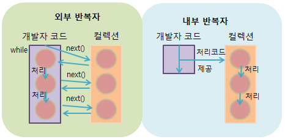
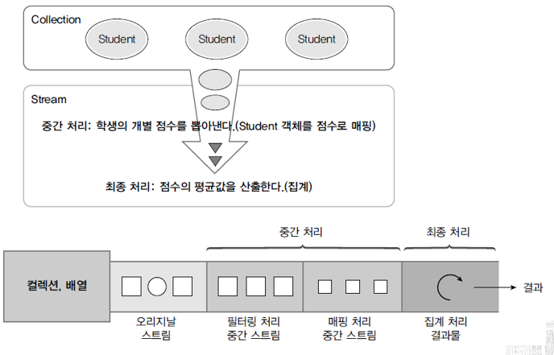

# 스트림
- 스트림은 반복자 : 컬렉션(배열 포함)의 요소를 하나씩 참조해서 람다식으로 처리할 수 있는 반복자
- 스트림 이전에는 iterator를 생성하고 반복문을 사용하였다.
- 스트림을 통해 이전 보다 간결하게 반복을 할 수 있게 되었다.

## 스트림의 특징
- 람다식으로 요소 처리 코드를 제공한다. 때문에 복잡한 코드를 간결하게 표현할 수 있다.
  - 스트림이 제공하는 대부분의 요소 처리 메소드는 함수적 인터페이스 매개타입을 가진다.
  - 매개값으로 람다식 또는 메소드 참조를 대입할 수 있다.

 ※ 예시 코드
  ```java
  List<Student> list = Arrays.adList(
            new Student("홍길동", 90),
            new Student("김철수", 80),
            );
  stream.forEach(s->{
    String name = s.getName();
    int score = s.getScore();
  })
  ```

- 내부 반복자를 사용하므로 병렬처리가 쉽다.
  - 외부 반복자(iterator): 개발자가 코드로 직접 컬렉션 요소를 반복해 요청하고 가져오는 코드(.next())
  - 내부 반복자(Stream): 컬렉션 내부에서 요소들을 반복시키고 개발자는 요소당 처리해야할 코드만 제공하는 코드 패텅
    - 요소 처리 코드에만 집중하면 된다.
    - 멀티 코어 CPU를 최대한 활용하기 위해 요소들을 분배시켜 병렬 처리 작업을 할 수 있다.
    - 병렬처리: 한가지 작업을 n개의 서브 작업으로 나눌 수 있으며 이들을 분리도니 스레드에서 병렬적으로 처리 한 후 서브 작업의 결과물을 결합하는 방식


        </img><br/>


  ※ 예시 코드

  ```java
    List<Student> list = Arrays.adList(
              "가나다","라마바","사아자","차카타", "파하거"
              );

              //순차처리
              list.stream()
                .forEach(ParallelExample :: print);

              //병렬처리
              list.parallerlStream()
                .parallelStream
                .forEach(ParallelExample :: print);   

  ```

  - 스트림은 중간 처리와 최종 처리를 할 수 있다.
    - 중간처리: 요소들의 매핑, 필터링, 정렬
      Data(JCK)- 미가공 데이터
      |
      중간처리(map,sort, filttering..)- 데이터 가공
      |
      최종처리(aggregation 집계)- Reduction 수행
  - 최종처리: 반복문, 카운트, 평균, 총합  
  </img><br/>


## 스트림의 종류

  </img><br/>

## 스트림 구현 객체를 얻는 방법
  | 리턴타입 | 메서드(매개변수) | 소스 |
  |---|:---:|---|
  | `Stream<T>` | java.util.Collection.stream() | 컬렉션 |
  | | java.util.Collection.parallelStream() | |
  | `Stream<T>` | Arraysstream(T[])   Stream.of(T[]) | 배열 |
  | `IntStream` | Arraysstream(int[])   IntStream.of(int[]) | |
  | `LongStream` | Arraysstream(long[])   LongStream.of(T[]) | |
  | `DoubleStream` | Arraysstream(double[])   DoubleStream.of(double[])| |
  | `IntStream` | IntStream.range(int, int) | int 범위 |
  | | IntStream.rangeClosed(int, int) | |
  | LongStream | LongStream.range(long, long) | long 범위 |
  | | LongStreamClosed(long, long) | |
  |`Stream<Path`| Files.find(Path, int, BiPredicate, FileVisitOptiopn) | 디렉토리 |
  |  | Files.list(Path) | |
  | `Stream<String>` | Files.lines(Path, Charset) | 파일 |
  | | BufferedReader.lines()| |
  | `DoubleStream` | Random.doubles(...) | 랜덤수 |
  | `IntStream` | Random.ints() | |
  | `LongStream` | Random.longs() | |

  - Files.find(Path, int, BiPredicate, FileVisitOptiopn) : path안에 있는 파일 중에서 BiPredicate라는 조건에 true인 것 뽑아 요소를 가지게 한다.FileVisitOptiopn은 필터링 기능을 의미
  - Files.lines(Path, Charset) : path에 있는 파일에서 문자타입(Charset, ex)UTF-8)을 확인해 한 라인씩 Stream의 요소로 만든다

### 배열로 부터 스트림 얻기
 ※ 예시 코드
```java
  String[] strArray = {"김기나", "이리니", "박다오"};
  Stream<String> strStream = Arrays.stream(strArray);
  strStream.forEach(a-> System.out.print(a+","));

  int[] intArray = {1,2,3,4,5};
  IntStream intStream = Arrays.stream(intArray);
  intStream.forEach(a-> System.out.print(a+","));

```
### 숫자 범위에서 스트림 얻기
```java
  IntStream stream = IntStream.rnageCloesd(1,100);// Closed는 마지막 100은 뺀 1~99까지를 범위로 지정함을 의미
  stream.forEach(a -> sum+= a);
  System.out.println("총합: " +sum);
```
### 파일에서 스트림 얻기
```java
  Path path = Paths.get("어떤 파일의 위치")
  Stream<String> stream;

  //Files.lines() 메소드 이용
  stream = Files.lines(Path, Charset.defaultCharset:());// defaultCharset:파일에 설정된 기본 문자셋을 선택한다는 의미
  //파일에 있는 행의 데이터를 스트림에 담는 코드
  stream.forEach(System.out :: println);
  System.out.println();

  //BufferedReader의 lines()메소드 이용
  File file = path.toFile();//path에 있는 파일을 FILE 타입 참조변수에 담는다.
  FileReader fileReader = new FileReader(file);// file을 통해 파일을 읽을 수 있는 리더를 만든다.
  BufferedReader br = new BufferedReader(fileReader);// BufferedReader 성능 향상을 위해 적용하는 코드
  stream = br.lines();// 파일의 라인별로 데이터를 담는다.
  stream.forEach(System.out :: println);

```

## 스트림 파이프라인

## 중간처리와 최종처리
  - 리덕션
    - 대량의 데이터를 가공해서 축소하는 것을 의미(합계, 평균값, 카운팅, 최대값, 최소값 등을 집계하는 것)
    - 요소가 리덕션의 결과물로 바로 집계할 수 없을 경우 중간처리가 필요
    - 중간 처리한 요소를 최종 처리해서 리덕션 결과물을 산출한다.

  - 스트림은 중간 처리와 최종 처리를 파이프라인으로 해결한다.
    - 파이프라인 : 스트림이 파이프라인 같다고 붙인 말
      - 중간처리 메서드(필터링, 매핑, 정렬)는 중간 처리된 스트림을 리턴, 이를 다시 다음 중간 처리 메서드가 호출해 파이프라인 형성
    - 최종 스트림의 집계 기능이 시작되기 전까지 중간처리는 지연된다
      - 최종 연산전에 값을 미리 계산하는 것이 라니라 최종 메서드가 실행될 때서야 처음부터 중간 스트림 메서드들이 실행된다.
      - 이는 연산 자원을 아끼기 위함이다.

    ※ 예시 코드
```java
  list.stream();
      .filter(m -> m.getSex() == Member.MALE); //stream()의 반환되는 Steam<Member>타입 객체를 통해 값을 얻고 이 객체를 통해 getSex()실행 및 Member.MALE과 비교, 해당 기준을 통과한 객체의 값만을 모아 또다른 스트림 객체로 반환
      .mapToInt(Member::getAge)//filter로 반환된 Steam<Member>타입의 객체를 받고 해당 객체를 통해 getAge()를 통해 또다른 값을 얻고 이를 IntSteam타입의 스트림으로 반환
      .average()// 반환타입: OptionalDouble
      .getAsDouble;

```
## 중간처리 메서드 및 최종 처리 메서드 모음

## 중간처리 메서드
  - 중간처리 메서드에는 크게 필터링, 매핑, 정렬, 루핑 4가지 기능이 있다.
  - 이들 메서드 중 일부는 특정 스트림(Ex. IntStream, LongStream 등)에만 적용되기에 활용을 위해선 메서드의 타입과 반환타입을 알고 있으면 좋다.
## 최종처리 메서드
  - 최종처리 메서드도 매칭, 집계, 루핑, 수집의 기능으르로 나뉘어진다.


### 중간 메서드 -  필터링 메서드
| 리턴타입 | 메서드(매개변수) | 설명 |
|---|:---:|---:|
| `Stream`, `IntStream`,`LongStream`, `DoubleStream` | distinct() | 중복제거 |
|  | filter(Predicate), filter(IntPredicate), filter(LongPredicate), filter(DoublePredicate) | 조건 필터링 |
|  | | |
|  | | |
|  | | |


#### distinct()
  - equals()가 true일 때 중복을 제거한다.

#### filter()
  - 파라미터인 Predicate가 true인 값만 리턴해 스트림으로 반환
  - Predicate는 함수형 인터페이스로서 앞의 스트림에서 필터링할 기준을 나타낸다. 보통 람다식으로 표현한다.


### 중간 메서드 -  매핑 메서드
  - 매핑이랑 스트링의 요소를 다른 요소로 대체하는 것을 의미( 객체를 int, long double 등으로 대체한다.)
  - 대체가 1 대 1 관계일 필요는 없다. 1대 多도 가능


#### flatMapXXX()
  - 한개의 요소를 대체하는 복수개의 요소들로 구성된 새로운 스트림을 리턴
  - 즉 어떤 한 객체 A에서 A1, A2, A3, ... 등의 여러 요소로 대체한다(뽑아 낸다)는 의미

  | 리턴타입 | 메서드(매개변수) | 요소 -> 대체 요소 |
  |---|:---:|---:|
  | `Stream <R>` | flatMap(Function<T, Stream<R> >) | T -> Stream<R> |
  | `DoubleStream` | flatMap(DoubleFunction< DoubleStream >) | ouble -> DoubleStream |
  | `IntStream` | flatMap( IntFunction< IntStream >) | int -> IntStream |
  | `LongStream`  | flatMap( LongFunction< LongStream >)| long -> LongStream |
  | `DoubleStream` | flatMapDouble( Function<T, DoubleStream >)| T -> DoubleStream |
  | `IntStream` | flatMap(Function<T, IntStream >) | T -> IntStream |
  | `LongStream` | flatMap(Function<T, LongStream >)| T -> LongStream|
 - 여기서 Function은 어떤 기능(제한조건, 함수)을 한다는 의미이다. 예로 Function<T, IntStream >은 T라는 **객체**를 받아 IntStream으로 반환한다는 의미이고 flatMap( LongFunction< LongStream >)는 Long 타입의 **값**이 담긴 스트림을 받아 LongStream 타입의 새로운 스트림으로 반환한다는 의미 . 주로 람다식을 작성한다.

 ※ 예제 코드
     ```java
     List<Stirng> inputLisrt2 = Arrays.asList("10, 20, 30", "40, 50, 60")
          inputLisrt2.stream()
              .flatMapToInt(data ->
               {String[] strArray = data.split(".");//10, 20, 30 나눠진 것을 10/ 20/ 30으로 구분
                int[] intArr = new int[strArray.length];// 구분해 놓은 배열 크기대로 int 배열 생성
                for(int i=0; i<strArray.length;
                    intArr[i] = Integer.parseInt(strArray[i].trim()); // 빈칸 제거 후 Stirng 배열의 값을 int로 바꿔 위에서 생성한 int 배열에 넣는다.
               }
                  return Arrays.stream(intArr);

     ```

#### mapXXX()
  - 요소를 대체하는 요소로 구성된 새로운 스트림
  - flatMap과 달리 주어진 하나의 요소를 다른 하나의 요소로 대체한다.(1대1)


#### asDoubleStream(), asLongStream(), boxed()
| 반환타입 | 메서드 | 설명 |
|---|:---:|---:|
| `DoubleStream` | asDoubleStream() | int -> double |
|  |  | long -> double |
| `LongStream` | asLongStream() | int -> long |
| `Stream<Integer>` | boxed() | int -> Integer |
| `Stream<Long>` | | long -> long |
| `Stream<Double>` | | double -> Double |
  - asDoubleStream(): IntStream의 int 요소 또는 LongStream의 long 요소를 double 요소로 타입 변환해 DoubleStream 생성
  - asLongStream(): IntStream의 int 요소 long 요소로 타입 변환해서 LongStream 생성
  - boxed(): int, long, double 요소를 Integer, Long, Double로 박싱해 Stream 생성


## 집계(Aggregate)
- 최정 처리 기능
    - 카운팅, 합계, 평균값, 최대값, 최소값 등 하나의 최종값을 산출한다
    - 대량의 데이터를 가공하여 축소하는 리덕션이라고 할 수 있다.

## 스트림이 제공하는 기본 집계함수
| 반환타입 | 메서드 | 설명 |
|---|:---:|---:|
| `long` | count() | 요소 개수 |
| `OptionalXXX` | findFirst() | 첫번째 요소 |
| `OptionalXXX`, `Optional<T>` | max(Comparator<T>), max() | 최대 요소 |
| `OptionalXXX`, `Optional<T>` | min(Comparator<T>), min() | 최소 요소 |
| `OptionalDouble` | average()| 요소 평균 |
| `int, long, double` | sum()| 요소 총합 |

## OptionalXXX 클래스
  - 자바 8부터 추가된 값을 저장하는 값 기반 클래스
  - java.util 패키지의 Optional, OptionalDouble, OptionalInt, OptionalLong 클래스를 의미
  - 저장된 값을 얻으려면 get(), getAsDouble(), getAsInt(), getAsLong()를 호출한다.

※ 예시 코드

```java
    public static void main(String[] args{
      long count = Arrays.stream(new int[] {1,2,3,4,5})
        .filter(n->n%2==0)
        .count();
        System.out.println("2의 배수 개수: " + count)

      long sum = Arrays.stream(new int[] {1,2,3,4,5})
        .filter(n->n%2==0)
        .sum();
        System.out.println("2의 배수 합: " + count)

      int max = Arrays.stream(new int[] {1,2,3,4,5})
        .filter(n->n%2==0)
        .max()// max의 반환 타입은 OptionalInt이기에 최종 매서드(getAsInt)를 입력해준다.
        .getAsInt();
        System.out.println("2의 배수 최대값: " + max)

      int min = Arrays.stream(new int[] {1,2,3,4,5})
        .filter(n->n%2==0)
        .mix()//
        .getAsInt();
        System.out.println("2의 배수 최소값: " + mix)

      int first = Arrays.stream(new int[] {1,2,3,4,5})
        .filter(n->n%3==0)
        .findFirst()
        .getAsInt();
        System.out.println("3의 배수 최초값: " + mix)  
      })
  ```

## Optional 클래스
  - 값을 저장하는 값 기반 클래스
      - Optional, OptionalDouble, OptioanlInt, OptionalLong
      - 집계 메소드의 리턴 타입으로 사용되어 집계 값을 가지고 있음
  - 특징
      - 집계 값이 존재하지 않을 경우 디폴트 값을 설정할 수도 있다.
      - 집계 값을 처리하는 Comsumer를 등록할 수 있다.


      | 반환타입 | 메서드 | 설명 |
      |---|:---:|---:|
      | `boolean` | isPresent | 값이 저장되어 있는지 여부 |
      | `T` | orElse() | 값이 저장되어 있지 않을 경우 디폴트 값(T, double 등등)을 반환 |
      | `double` | orElse(double) |  |
      | `int` | orElse(int) |  |
      | `long` | orElse(long)|  |
      | `void` | ifPresent(Consumer)| 집계 값이 있을 경우 이를 Consumer에서 처리(람다식이나 메서드  처리) |
      |  | ifPresent(DoubleConsumer)|  |
      |  | ifPresent(IntConsumer)|  |
      |  | ifPresent(LongConsumer)|  |

    ```java
    import java.util.ArrayList;
    import java.util.List;

    public class OptionalExample {


    public static void main(String[] args{
      List<Integer> list = new ArrayList<>();

      double avg = list.stream(})
        .mapToInt(Integer :: intValue)// list가 가진 Integer타입의 요소에서 intvalue를 통해 int값을 갖는 스트림을 만들겠다
        .average()
        .getAsDouble();
      // 위 코드 실행시 NotSuchElementException 발생, 현재 스트림에는 아무런 값이 없기에 바로 값을 구할 수 없다(매서드 정의단계가 아닌 main 메서드에서 실제 실행하는 단계기 때문)

      OptionalDouble optional = list.stream(})// average()를 통해 반환된 OptionalDoubl를 직접 받는다
        .mapToInt(Integer :: intValue)// list가 가진 Integer타입의 요소에서 intvalue를 통해 int값을 갖는 스트림을 만들겠다
        .average();
          if(optional.isPresent()){//NoSuchElementException를 방지하기 위해 요소가 없을 경우 따로 처리
            System.out.println("방법1의 평균: " + optional.getAsDouble());
          }
          else{System.out.println("0.0");
          }
        //--------------------------------------------------------------------------
      double avg = list.stream()     
        .mapToInt(Integer :: intValue)
        .average()
        .orElse(0.0);

        System.out.println("방법2의 평균: " + avg);

        //--------------------------------------------------------------------------

      double avg = list.stream()     
        .mapToInt(Integer :: intValue)
        .average()
        .ifPresent(a -> System.out.println("방법3의 평균: " + avg));
        // a는 average()로 계산한 평균(value)을 의미, 즉 a가 존재하면 ()안의 람다식(Consumer)싱행

        System.out.println("방법3의 평균: " + avg);
    }
    ```  


  reduce() 메서드
  - 프로그램화해서 다양한 집계(리덕션) 결과물을 만들 수 있다.
  - 즉 특정한 값을 집계하는데 사용함.

  | 적용 인터페이스 | 리턴타입 | 메서드(매개변수) |
  |---|:---:|---:|
  | `Stream` | Optional<T> | reduce(BinaryOperator<T> accumulator) | 요소가 없다면 NoSuchElementException 발생한
  |  | T | reduce( T identity, BinaryOperator<T> accumulator) | 요소가 없다면 디폴트값인 T identity가 반환될 것
  | `IntStream` | OptionalInt | reduce(IntBinaryOperator<T> op)  |  同 |
  | `` | int | reduce(int Identity, IntBinaryOperator<T> op) | 同 |
  | `LongStream` | reduce(LongBinaryOperator<T> op) | 同 |
  | | long | reduce(long identity, LongBinaryOperator<T> op) | 同
  | `DoubleSteam` | OptionalDouble | reduce(DoubleBinaryOperator<T> op) |同
  |  | double | reduce(double identity, DoubleBinaryOperator<T> op) | 同

  매개변수
    - XXXBinaryOperator: 두 개의 매개값을 받아 연산 후 리턴하는 함수적 인터페이스
    - identity: 스트림에 요소가 전혀 없을 경우 리턴될 디폴트 값

  예제 코드: 학생들의 성적 총점
  ```java
  int sum = studentList.stream();
    .map(student :: getScore)
    .reduce((a, b) -> a+b)
    .get();
    // NoSuchElementException 발생 우려 존재(get()실행)
//--------------------------------
```java
  int sum = studentList.stream();
    .map(student :: getScore)
    .reduce(0, (a, b) -> a+b);
    // 디폴트 값으로 0을 넣어줌,NoSuchElementException 방지

```

## 수집 collect()
  - 최종 처리 기능으로 요소들을 수집 또는 그룹핑한다.  
    - 필터링 또는 매핑된 요소들로 구성된 새로운 컬렉션을 생성한다.

    - 요소들을 그룹핑하고 집계(리덕션)을 할 수 있다.

  ※ 필터링한 요소 수집
  | 리턴타입 | 메소드(매개변수) | 인터페이스 |
  |---|:---:|---:|
  | `R` | collect(Collector<T,A,R> collector) | Stream |
    collect()를 통해 요소를 어떤 컬렉션(List, Set, Map 등)에 저장할 것인지를 결정함

 ### Collector의 타입 파라미터의 역
      - T : 수집할 요소
      - A : 누적기(accumulator)- T라는 요소를 Collection에 수집하는 기능 수행,
        ※ ?인 이유는 컬렉션 프레임(L,S,M)의 경우 각자 주어진 요소를 저장하는 소스코드가 내장해 있기에 구체적으로 명시하지 않는다는 의미.
      - R : 요소가 저장될 새로운 컬렉션- T 요소가 수집될 장소, 저장
      - 즉 T요소를 A누적기가 R에 저장

### Collector의 구현 객체
  - Collectors 클래스의 정적 메소드를 이용
  정적 메소드 모음(collect()에 들어갈 매개변수(parmeter) 정리)

  | 리턴타입 | 메소드(매개변수) | 인터페이스 |
  |---|:---:|---:|
  | `Collector<T,?,Collection<T>>` | Collectors.toCollection(Supplier <T>) | Supplier가 제공하는 컬렉션에 요소를 수집하는 컬렉터를 반환한다. |
  | `Collector<T,?,ConcurrentMap<K,U>>` | Collectors.toConcurrentMap(...) | toConcurrentMap()는 멀티스레드 환경에서 쓰레드의 안전한 ConcurrentMap을 만들어 요소를 수집&반환한다. |
  | `Collector<T,?,List<T>>` | Collectors.toList() | List에 요소들을 수집하는 컬렉션을 반환 |
  | `Collector<T,?,Set<T>>` | Collectors.toSet(...) | Set에 요소들을 수집하는 컬렉션을 반환 |
  | `Collector<T,?,Map<T>>` | Collectors.toMap(...) | Map에 요소들을 수집하는 컬렉션을 반환 |

  - A(누적기)가 ?인 이유
    - List, Set, Map 컬렉션에 누적할 경우에는 별도의 A(누적기)가 필요 없다.

 ※ 예시 코드
  * 전체 학생 List에서 남학생들만 별도의 List로 생성
  ```java
  List<Student> maleList = totalList.stream()
      .filter(s->s,getSex()==Student.Sex.MALE)
      .collect(Collectors.toList());
  ```
  * 전체 학생 List에서 여학생 들만 별도 HashSet으로 생성
  ```java
  Set<Student> femaleSet = totalSet.stream()
      .filter(s->s,getSex()==Student.Sex.MALE)
      .collect(Collectors.toCollection(HashSet::new));
      //Collectors.toCollection(Supplier <T>
      //Supplier(HashSet::new)가 제공하는 컬렉션에 요소를 넣겠다는 의미

  ```    


## 컬렉션과 스트림의 차이

  -스트림 특징
    - 컬렉션의 요소를 하나씩 참조해 람다식으로 처리할 수 있게 해주는 반복자.
    - 컬렉션, 배열, 파일 등의 대량 데이터를 가공해 다양한 결과를 낼 수 있다.(평균, 최대, 최속밧, 카운팅, 집계 함수 등등)


  - 컬렉션과의 공통점
    - 연속된 요소 형식의 값을 저장하는 자료구조 인터페이스를 제공
    - 요소에 순차적으로 접근

  - 컬렉션과의 차이점
    1. 컬렉션
      - 각 계산식을 만날 때마다 데이터가 계산된다.
      	모든 요소를 처음부터 하나씩 순환하고 그 때마다 계산을 수행 10개의 요소가 있다면 0번부터 9번까지 10번의 계산 수행하고 계산이 끝난 결과물만 컬렉션에 추가된다.
      - 데이터의 접근, 읽기, 변경, 저장이 주요 관심사
      - 데이터에 접근하는 방법을 직접 작성해야 한다.
      - Iterator로 모든 요소를 순환해야 한다.
      - 메모리에 모든 요소가 올라가 있는 상태에서 요소를 누적시키며 결과를 계산한다.
      - 메모리 사용량이 늘어난다.

  2. 스트림
    - 최종 연산이 실행될 때에 데이터가 계산된다.
    	최종 연산이란 쉽게 사용자의 요청으로 볼 수 있다.  최종연산을 위한 여러 작업(필터링, 매핑, 정렬 등)이 미리 실행되어 자원을 소모하지 않는 다는 것. 이는 모든 요소에 최종연산을 다 수행하는 것이 아닌 중간연산을 통해 코어 작업(최종연산)을 위한 요소만 계산하면 된다는 의미.
    - 계산식(람다)을 표현하는 것이 주요 관심사
    - 데이터에 접근하는 방법이 추상화되어있다.
    - 계산식을 미리 적어두고 계산시에 람다식으로 JVM에 넘긴다.
    - 내부에서 요소들을 어떻게 메모리에 올리는 지는 관심사가 아니다
    - 메모리 사용량이 줄어든다.

  1) 데이터 계산 시점
    - 컬렉션 : 모든 요소를 컬렉션에 추가하기전에 계산되어야 한다.
    - 스트림 : 요청을 할 때만 요소를 계산하는 고정된 자료구조

  2) 반복의 일회성
    - 스트림에서는 컬렉션과 달리 반복문(forEach)을 단 한번만 수행할 수 있다.
    - 다중 반복문 수행시 에러 발생

  ``` java
   Stream<Food> s = foodList.stream();
  s.forEach(System.out::println); // 정상
  s.forEach(System.out::println); // IllegalStateException 발생
  ```
  3) 외부반복, 내부반복
  - 컬렉션은 각 요소를 어떻게 반복할지를 사용자가 직접 반복문을 코드로 작성해야한다.
  - 스트림은 for, while 등의 반복문없이 반복할 메서드만 명시하면 된다.
  - 이는 작업을 직렬이 아닌 병렬로 처리하여 작업을 최적화할 수 있게 된다.


  컬렉션에서 내부 요소를 이용할 때는 요소순환을 위한 Iterator객체를 생성하고 이를 통해  for, while 등의 반복문을 사용하여 요소를 순환을 하였다.
  하지만 이러한 방식을 데이터가 커질 수록 성능이 저하되는 문제를 발생시켰다.
  스트림은 컬렉션에서 요소를 하나씩 처리하는 Iterator 객체 생성없이 컬렉션 자체를 선언형으로 처리한다.

   또한 여러 계산을 위해서 이전에 컬렉션에서는 내부 반복문을 여러번 사용하는 것처럼 복잡한 구조가 필요했고 코드의 양도 방대해졌다.

   하지만 스트림은 이를 파이프라인닝을 통한 병렬처리를 도입하여  paralleStream을 통해 별도의 멀티 스레드 구현이 필요하지 않는다. 때문에 코드가 간결해져 성능이 향상되었다.
