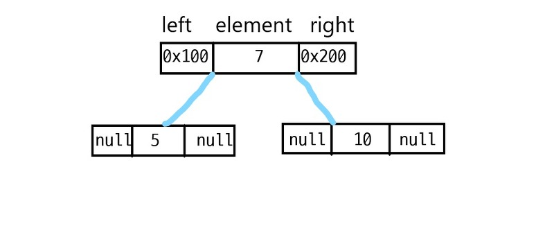
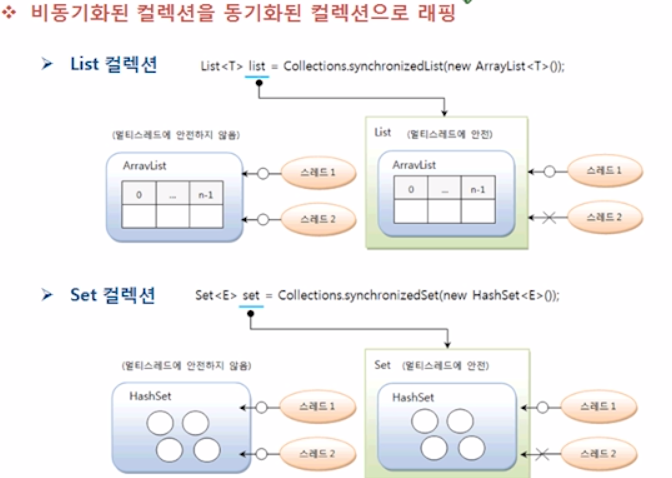
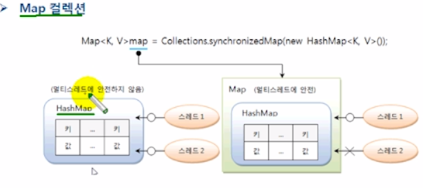

# 컬렉션 프레임 워크

### 컬렉션 프레임 워크란??

- 컬렉션이란? 여러 객체(데이터)를 모아 놓은 것
- 프레임 워크란? 표준화, 정형화된 체계적인 프로그래밍
- 자바에서 객체들을 효율적으로 다루기 위해(즉 데이터의 추가, 삭제, 검색 등을 위해) Collection으로 만들고 이를 위한 인터페이스 및 클래스를 구현 한 것.
- java.utill 패키지에 포함된 여러 클래스와 인터페이스
- 컬렉션 클래스 : 다수의 데이터를 저장할 수 있는 클래스(Vector, ArrayList, HashSet 등등)

### 컬렉션의 주요 인터페이스

- 자료 구조에 따라 주요 인터페이스가 나뉜다.
    - List 인터페이스
    - Set 인터페이스
    - Map 인터페이스
- List와 Set의 공통 부분을 Collection 인터페이스로 정의한다.
- 컬렉션의 주요 메서드

[Collection 인터페이스의 주요 메서드](https://www.notion.so/Collection-f0f8d0b082b5424398ec71b9d675c0b4)

### 컬렉션 클래스

- 컬렉션 프레임워크에 해당하는 인터페이스를 구현한 클래스를 의미(List, Set, Map 중 하나를 구현)

[List 컬렉션 클래스](https://www.notion.so/List-8ca981e855a341a68f2deacece8dbafc)

순서O / 중복 O

대표적인 클래스는 다음과 같다

- Linked List<E>
- Stack<E>
- Vector<E>
- ArrayList<E>

### **ArrayList<E> 클래스**

내부적으로 배열의 구조를 이용해 데이터를 저장

크기를 배열처럼 한정하지 않아도 됨(가변적)

### 예제

```java
ArrayList<Integer> arrList = new ArrayList<Integer>();
// add() 메소드를 이용한 요소의 저장

arrList.add(40);
arrList.add(20);
arrList.add(30);
arrList.add(10);

// for 문과 get() 메소드를 이용한 요소의 출력

for (int i = 0; i < arrList.size(); i++) {
    System.out.print(arrList.get(i) + " ");
}

// remove() 메소드를 이용한 요소의 제거
arrList.remove(1);

// Enhanced for 문과 get() 메소드를 이용한 요소의 출력
for (int e : arrList) {
    System.out.print(e + " ");
}

// Collections.sort() 메소드를 이용한 요소의 정렬
Collections.sort(arrList);

// iterator() 메소드와 get() 메소드를 이용한 요소의 출력
Iterator<Integer> iter = arrList.iterator();

while (iter.hasNext()) {
    System.out.print(iter.next() + " ");
}

// set() 메소드를 이용한 요소의 변경
arrList.set(0, 20);
for (int e : arrList) {
    System.out.print(e + " ");
}
// size() 메소드를 이용한 요소의 총 개수

System.out.println("리스트의 크기 : " + arrList.size());
// 출처 : http://www.tcpschool.com/java/java_collectionFramework_list
```

### **LinkedList<E> 클래스**

- ArrayList의 단점을 보완
- 비순차적 데이터 저장
- 링크(link)를 이용한 데이터 관리
- 하나의 노드는 해더가 존재해 다음 노드의 위치정보를 저장
- 헤더가 2개 존재해 각각 앞, 뒤 노드의 위치 정보를 저장,  노드간의 순서 관리가 유용

장점

- 데이터의 저장, 삭제가 간편

단점

- 데이터의 검색에 있어 index가 없기에 첫 노드부터 하나씩 탐색해야 한다

```java
LinkedList<String> lnkList = new LinkedList<String>();

// add() 메소드를 이용한 요소의 저장
lnkList.add("넷");
lnkList.add("둘");
lnkList.add("셋");
lnkList.add("하나");

// for 문과 get() 메소드를 이용한 요소의 출력
for (int i = 0; i < lnkList.size(); i++) {
    System.out.print(lnkList.get(i) + " ");
}

// remove() 메소드를 이용한 요소의 제거
lnkList.remove(1);

// Enhanced for 문과 get() 메소드를 이용한 요소의 출력
for (String e : lnkList) {
    System.out.print(e + " ");
}

 // set() 메소드를 이용한 요소의 변경
lnkList.set(2, "둘");
for (String e : lnkList) {
    System.out.print(e + " ");
}

// size() 메소드를 이용한 요소의 총 개수
System.out.println("리스트의 크기 : " + lnkList.size());
// 출처 : http://www.tcpschool.com/java/java_collectionFramework_list
```

[**List 인터페이스 메소드**](https://www.notion.so/List-fa610ef844b04ad9a00272f21c623e0b)


## Set 인터페이스
  - 집합의 개념과 유사함(순서X, 중복X)
  - 이를 구현한 클래스로는 Hashset, LinkedHashSet, TreeSet이 있다.
  - 인덱스를 객체로 검색해서 가져오는 메서드가 없다.
  - 대신 iterator를 통해 한번씩 모든 대상을 반복해서 확인해야 한다.

### iterator
    - 컬렉션 프레임워크에서는 컬렉션에 저장된 요소를 읽어오는 방법으로 iterator 인터페이스로 표준화하고 있다. iterator 인터페이스를 구현한 클래스의 인스턴스가 만들어고, 이를 반환하는 iterator 매서드를 정의하여 각 요소에 접근하도록 합니다.
    따라서 Collection 인터페이스를 상속받는 List와 Set 인터페이스 에서도 iteraotor()를 사용할 수 있다.

### iterator 인터페이스의 메서드
    - boolean hasNext() : 가져올 객체가 있으면 true, 없으면 false
    - E next() : 컬렉션에서 하나의 객체를 가져온다.
    - void remove() : Set에서 객체를 제거한다.

    - 즉 컬렉션 프레임워크의 인터페이스를 구현한 클래스가 있고 그 클래스가 만들어낸 인스턴스의 데이터들을 가져오기(읽어오기) 위해서 사용할 iterator라는 인터페이스를 따로 만들어 낸 것이다.

### Set의 주요 메서드
    | 기능 | 메서드(매개변수) | 설명 |
    |---|:---:|---|
    | `객체 추가` | boolean add(E e) | 주어진 객체를 저장, 객체가 성공적으로 저장되면 true, 중복이면 false 리턴 |
    | `객체 검색` | boolean contains(Object o) | 주어진 객체가 저장되어 있는지 여부 |
    |  | isEmpty() | 컬렉션이 비어 있는지 조사 |
    |  | Iterator<E> iterator() | 저장된 객체를 <u>한번씩<u> 가져오는 반복자 리턴 |
    |  | int size() | 저장되어 있는 전체 객체수 리턴 |
    | `객체 삭제` | void clear() | 저장된 모든 객체를 삭제 |
    |  | boolean remove(Object o) | 주어진 객체를 삭제 |
    | | IntStream.rangeClosed(int, int) | |

    ※ 예시 코드
  ```java
    Set<String> set = ...;
    Iterator<String> iterator = set iterator();
    while(iterator.hasNext()){
      //String 객체 하나를 가져옴
      String str = iterator.next();
    }

    or

    while(iterator.hasNext()){
      String str = iterator.next();
      if(str.equals("홍길동")) {
        iterator.remove();
      }

  ```

### HashSet
  ```java
    - Set<E> set = new HashSet<E>();
  ```
    - 동일 객체 및 동등 객체는 중복 저장하지 않는다.
    - 동등 객체 판단방법
    </img><br/>
    - 1차로 두 객체의 해쉬코드 값을 비교하고(동일 객체 확인) equals를 통해 동등객체여부 확인하여 중복 제거
    ```java
    Set<String> set = new HashSet<String>();

            set.add("Java"); set.add("JDBC"); set.add("Servlet/JSP"); set.add("Java"); set.add("iBATIS");

            int size = set.size(); // 저장된 객체 수 얻기
            System.out.println("총 객체수: " + size);

            Iterator<String> iterator = set.iterator(); // 반복자 얻기
            while(iterator.hasNext()) { // 객체 수만큼 루핑
                String element = iterator.next(); // 한 개의 객체를 가져온다
                System.out.println("\t" + element);
            }

            set.remove("JDBC");
            set.remove("iBATIS");

            System.out.println("총 객체수: " + set.size());

            for(String element : set) {
                System.out.println("\t" + element);
            }

            set.clear();        
            if(set.isEmpty()) { System.out.println("비어 있음"); }
    ```


## Map 인터페이스
  - 키와 값으로 구성된 Map.Entry 객체를 저장하는 구조
  - 키와 값은 모두 객체
  - 키는 중복 X, 값은 중복 O
  - 구현 클래스로는 HashMap, Hashtable, LinkedHashMap, Properties, TreeMap이 있다.


### Map의 주요 메서드
    | 기능 | 메서드(매개변수) | 설명 |
    |---|:---:|---|
    | `객체 추가` | V pout(K key, V value) | 주어진 키와 값을 추가, 저장이 되면 값을 리턴 |
    | `객체 검색` | boolean containsKey(Object Key) | 주어진 키가 있는지 여부 |
    |  | boolean containsValue(Object value) | 주어진 값이 있는지 여부|
    |  | Set<Map.Entry<K, V> entrySet() | 키와 값의 쌍으로 구성된 모든 Map.Entry 객체를 Set에 담아서 리턴 |
    |  | V get(Object key) | 주어진 키의 값을 리턴 |
    |  | boolean isEmpty | 컬렉션이 비어있는지 여부 확인 |
    |  | Set<K> keySet() | 모든 키를 Set객체에 담아서 리턴|
    |  | int size() | 저장되어 있는 키의 수 리턴 |
    |  | Collection<V> values() | 저장된 모든 값 Collection에 담아서 리턴 |
    | `객체 삭제` | void clear() | 모든 Map.Entry(키와 값)를 삭제 |
    |  | V remove(Object key) | 주어진 키와 일치하는 Map.Entry 삭제, 삭제가 되면 그 값을 리턴 |

    ※ 예제 코드
    ``` java
    public static void main(String[] args) {
        //Map 컬렉션 생성
        Map<String, Integer> map = new HashMap<String, Integer>();

        //객체 저장
        map.put("신용권", 85);
        map.put("홍길동", 90);// 키가 같기 때문에 제일 마지막에 저장한 값으로 대체
        map.put("동장군", 80);
        map.put("홍길동", 95);
        System.out.println("총 Entry 수: " + map.size());// 저장된 총 Entry 수 얻기

        //객체 찾기        // 이름(키)으로 점수(값)를 검색
        System.out.println("\t홍길동 : " + map.get("홍길동"));
        System.out.println();

        //객체를 하나씩 처리 Map에서 데이터를 순환해야할 때는 Set으로 타입을 바꾸어야 한다.
        Set<String> keySet = map.keySet(); // Key Set 얻기
        Iterator<String> keyIterator = keySet.iterator();// 반복해서 키를 얻고 값을 Map에서 얻어냄
        while(keyIterator.hasNext()) {
          String key = keyIterator.next();
          Integer value = map.get(key);
          System.out.println("\t" + key + " : " + value);
        }        
        System.out.println();    

        //객체 삭제
        map.remove("홍길동");
        System.out.println("총 Entry 수: " + map.size());

        //객체를 하나씩 처리
        Set<Map.Entry<String, Integer>> entrySet = map.entrySet();
        Iterator<Map.Entry<String, Integer>> entryIterator = entrySet.iterator();
        while(entryIterator.hasNext()) {
          Map.Entry<String, Integer> entry = entryIterator.next();
          String key = entry.getKey();
          Integer value = entry.getValue();
          System.out.println("\t" + key + " : " + value);
        }
        System.out.println();

        //객체 전체 삭제
        map.clear();
        System.out.println("총 Entry 수: " + map.size());
    }
    ```

### Hashtable 클래스
  - 키 객체는 hashCode()와 equals()를 재정의해서 동등객체가 될 조건을 정해야 한다.
  - Hashtable은 스레드 동기화가 되어 있기 때문에 복수의 스레드가 동시에 Hashtable에 접근해서 객체를 추가, 삭제하더라도 스레드에 안전(thread safe)하다
  - 즉 스레드1이 어떤 k,m에 접근하여 사용중이라면 그동안 스레드2는 해당값을 접근할 수 없다는 의미. 즉 모든 키와 값에 동기화가 적용되어있는 것과 같다(synchronization)
  - 따라서 멀티 쓰레드 환경에서는 동기화가 제공안되는 hashMap보다는 hashtable이 더 안정성면에서 적합하다. 물론 동기화로 인해 성능은 조금 떨어진다.

``` java
    Map<String, String> map = new Hashtable<String, String>();

        map.put("spring", "12"); map.put("summer", "123"); map.put("fall", "1234");   map.put("winter", "12345");

        Scanner scanner = new Scanner(System.in); // 키보드로부터 입력된 내용을 받기 위해 생성

        while(true) {
            System.out.println("아이디와 비밀번호를 입력해주세요");
            System.out.print("아이디: ");
            String id = scanner.nextLine(); // 키보드로 입력한 아이디를 읽는다

            System.out.print("비밀번호: ");
            String password = scanner.nextLine(); // 키보드로 입력한 비밀번호를 읽는다
            System.out.println();

            if(map.containsKey(id)) { // 아이디인 키가 존재하는지 확인한다
                if(map.get(id).equals(password)) { // 비밀번호를 비교한다
                    System.out.println("로그인 되었습니다");
                    break;  
                } else {
                    System.out.println("비밀번호가 일치하지 않습니다.");
                }                
            } else {
                System.out.println("입력하신 아이디가 존재하지 않습니다");
            }
        }
```
### Properties
  - 키와 값을 String 타입으로 제한한 Map 컬렉션이다.
  - Properties는 프로퍼티(.properties) 파일을 읽어 들일 때 주로 사용

#### 프로퍼티 파일
  - 옵션 정보, 데이터베이스 연결정보, 국제화(다국어)정보를 기록한 텍스트 파일로 활용
  - 애플리케이션에서 주로 변경이 잦은 문자열을 저장해서 유지보수를 편하게 만들어줌

  - [database.properties] 키=값으로 구성된 프라퍼티
  1. driver = oracle.jdbc.OracleDriver
  2. url=jdbc:oracle:thin:@localhost:1521:orcl
  3. username = scott
  4. password = tiger

  - 키와 값이 = 기호로 연결되어 있는 텍스트 파일로 ISO 8859-1 문자셋으로 저장
  - 한글은 유니코드(Unicode)로 변환되어 저장
    country = 대한민국  →  country = \uB5300\u55c\u3287
    language = 한글   →  language = \uD55C\uAE00  


## 검색기능을 강화시킨 컬렉션 TreeSet & TreeMap
  - 이진트리(binary tree)를 사용하기 때문에 검색 속도 향상
  - 부모 노드와 자식 노드로 구성
    - 왼쪽 자식 노드 : 부모보다 적은 값
    - 오른쪽 자식 노드 : 부모보다 큰 값
    - 즉 현재 노드의 값보다 작으면 왼쪽, 크면 오른 쪽
    - 이러한 구조로 인해 값들의 정렬이 쉽다.
    </img><br/>

### TreeSet
  ```java
  TreeSet<E> treeSet = new TreeSet<E>();
  ```
  - 이진 트리를 기반으로한 Set 컬렉션
  - 왼쪽과 오른쪽 자식노드를 참조하기 위한 두개의 변수로 구성
    </img><br/>

#### 주요 메서드
  | 리턴 타입 | 메서드(매개변수) | 설명 |
  |---|:---:|---|
  | `E` | first() | 제일 낮은 객체를 리턴(제일 왼쪽 값) |
  | `E` | last() | 제일 높은 객체를 리턴(제일 오른쪽 값) |
  | `E` | lower(E e) | 주어진 객체보다 바로 아래 객체를 리턴 |
  | `E` | higher(E e) | 주어진 객체보다 바로 위 객체를 리턴 |
  | `E` | floor(E e) | 주어진 객체와 동등한 객체가 있으면 리턴, 만약 없다면 주어진 객체의 바로 아래의 객체를 리턴 |
  | `E` | ceiling(E e) | 주어진 객체와 동등한 객체가 있으면 리턴, 만약 없다면 주어진 객체의 바로 위의 객체를 리턴 |
  | `E` | pollFirst() | 제일 낮은 객체를 꺼내오고 컬렉션에서 제거함 |
  | `E` | pollLast() | 제일 높은 객체를 꺼내오고 컬렉션에서 제거함 |

  ※ 예제 코드
  ```java
    TreeSet<Integer> scores = new TreeSet<Integer>();
        scores.add(new Integer(87));
        scores.add(new Integer(98));
        scores.add(new Integer(75));
        scores.add(new Integer(95));
        scores.add(new Integer(80));

        Integer score = null;

        score = scores.first();
        System.out.println("가장 낮은 점수: " + score);

        score = scores.last();
        System.out.println("가장 높은 점수: " + score + "\n");

        score = scores.lower(new Integer(95));
        System.out.println("95점 아래 점수: " + score);

        score = scores.higher(new Integer(95));
        System.out.println("95점 위의 점수: " + score + "\n");        

        score = scores.floor(new Integer(95));
        System.out.println("95점 이거나 바로 아래 점수: " + score);

        score = scores.ceiling(new Integer(85));
        System.out.println("85점 이거나 바로 위의 점수: " + score + "\n");

        // 1
        Iterator<Integer> iterator = scores.iterator();
        while(iterator.hasNext())
        {  int s = iterator.next();
            // iterator.remove(); // remove를 따로해줘야함
            System.out.println(s);
        }
        // 2. 밑에꺼는 꺼내고 없앤다
        /*
        while(!scores.isEmpty())
        {  score = scores.pollFirst(); // 제일 낮은 객체를 꺼내오고 컬렉션에서 제거함
            System.out.println(score + "(남은 객체 수: " + scores.size() + ")");
        }
        */
        System.out.println("=");
                while(!scores.isEmpty())
        {  score = scores.pollLast(); // 제일 높은 객체를 꺼내오고 컬렉션에서 제거함
            System.out.println(score + "(남은 객체 수: " + scores.size() + ")");
        }
  ```
#### iterator 적용
    | 리턴 타입 | 메서드(매개변수) | 설명 |
    |---|:---:|---|
    | `Iterator<E>` | descendingIteraotr() | 내림차순으로 정렬된 Iterator를 리턴 |
    | `NavigableSet<E>` | descendingSet() | 내림차순으로 정렬된 NavigableSet을 반  |

  ※ 예제 코드
  ```java
 public static void main(String[] args) {
        TreeSet<Integer> scores = new TreeSet<Integer>();
        scores.add(new Integer(87));
        scores.add(new Integer(98));
        scores.add(new Integer(75));
        scores.add(new Integer(95));
        scores.add(new Integer(80));
        // 내림차순
        NavigableSet<Integer> descendingSet = scores.descendingSet();
        for(Integer score : descendingSet) {
            System.out.print(score + " ");
        }
        System.out.println();
        // 오름차순
        NavigableSet<Integer> ascendingSet = descendingSet.descendingSet();
        //TIP. descendingSet()을 한번 더 하면 내림차순에서 오름차순으로 바뀐다.

        for(Integer score : ascendingSet) {
            System.out.print(score + " ");
        }
    }
    ```

## ※ NavigableSet의 메서드

### 객체 생성
  - NavigableSet는 자바 6부터 추가된 개념으로 SortedSet에서 확장된 인터페이스이다.
  - TreeSet이 이 NavigableSet 인터페이스의 주요 구현 클래스이며 TreeSet 객체 생성 후에 NavigableSet 타입 변수를 할당하면 된다.
  ```java
      NavigableSet<String> animalSet = new TreeSet<>(Arrays.asList("Dog",
                                                                  "Cat",
                                                                  "Tiger",
                                                                  "Lion",
                                                                  "Elephant"));
    // [Cat, Dog, Elephant, Lion, Tiger]

  ```
### 역순 접근: descendingIterator(), descendingSet()
  - SortedSet의 경우 정렬된 원소들을 역방향으로 순회하는 것이 어렵다는 단점이 있음
  - List의 하위 타입이 아니기에 인덱스 접근도 불가능
  - 이를 보완하기 위해 NavigableSet은 역방향 이터레이터를 반환하는 descendingIterator()를 제공한다
  ```java
      for (Iterator<String> iter = animalSet.descendingIterator(); iter.hasNext(); ) {
      System.out.println(iter.next());
    }
  ```
  - 또한 descendingSet()을 이용해 역순으로 정렬된 새로운 Set을 구할 수도 있다.
  ```java
        NavigableSet<String> revAnimalSet = animalSet.descendingSet();
        System.out.println(revAnimalSet);
        // [Tiger, Lion, Elephant, Dog, Cat]
  ```

### 내부 요소 제거: pollFirst(), pollLast()
  - Sorted에서 처음과 마지막 요소를 반환하는 메서드(first(), last())에 더해 NavigableSetdptjsms 원소 삭제까지 수행할 수 있다.
  ```java
      String first = animalSet.pollFirst();// 첫 요소 제거하고 그 값 반
      System.out.println("#first: " + first); // #first: Cat

      String last = animalSet.pollLast();// 마지막 요소 제거하고 그 값 반환
      assertThat(last).isEqualTo("Tiger");(); // #last: Tiger
  ```

### 가장 근접한 원소 탐색: ceiling(), floor(), higher(), lower()
  - 매개변수로 들어온 값과 근접하는 큰 or 작은 원소를 반환하는 메서드들이다.
  - ceiling(이상), floor(이하) : >=, <=
  - higher(초과), lower(미만) : >, <
  ```java
      String ceiling = animalSet.ceiling("Elephant");//코끼리 이상의 값을 animalSet에서 찾아 반환
      System.out.println("#ceiling: " + ceiling); // #ceiling: Elephant

      String floor = animalSet.floor("Elephant");//코끼리 이하의 값을 animalSet에서 찾아 반환
      System.out.println("#floor: " + floor); // #ceiling: Elephant

      String higher = animalSet.higher("Elephant");//코끼리 초과의 값을 animalSet에서 찾아 반환
      System.out.println("#higher: " + higher); // #higher: Lion

      String lower = animalSet.lower("Elephant");//코끼리 미만의 값을 animalSet에서 찾아 반환
      System.out.println("#lower: " + lower); // #lower: Dog
  ```


### TreeMap
  - 이진트리(binary tree) 기반의 Map 컬렉션
  - 키와 값이 저장된 Map.Entry를 저장
  - 왼쪽과 오른쪽 자식 노드를 참조하기 위해 두개의 변수로 구성


#### 주요 메서드
  | 리턴 타입 | 메서드(매개변수) | 설명 |
  |---|:---:|---|
  | `Map.Entry<K, V>` | firstEntry() | 제일 낮은 Map.Entry를 리턴(제일 왼쪽 값) |
  | `Map.Entry<K, V>` | lastEntry() | 제일 높은 Map.Entry를 리턴(제일 오른쪽 값) |
  | `Map.Entry<K, V>` | lowerEntry(K key) | 주어진 객체보다 바로 아래 Map.Entry를 리턴 |
  | `Map.Entry<K, V>` | higherEntry(K key) | 주어진 객체보다 바로 위 Map.Entry를 리턴 |
  | `Map.Entry<K, V>` | floorEntry(K key) | 주어진 객체와 동등한 키가 있으면 리턴, 만약 없다면 주어진 객체의 바로 아래의 객체를 리턴 |
  | `Map.Entry<K, V>` | ceilingEntry(K key) | 주어진 객체와 동등한 키가 있으면 리턴, 만약 없다면 주어진 객체의 바로 위의 객체를 리턴 |
  | `Map.Entry<K, V>` | pollFirstEntry() | 제일 낮은 객체를 꺼내오고 컬렉션에서 제거함 |
  | `Map.Entry<K, V>` | pollLastEntry() | 제일 높은 객체를 꺼내오고 컬렉션에서 제거함 |


   ※ 예제 코드
```java
    TreeMap<Integer,String> scores = new TreeMap<Integer,String>();
        scores.put(new Integer(87), "홍길동");
        scores.put(new Integer(98), "이동수");
        scores.put(new Integer(75), "박길순");
        scores.put(new Integer(95), "신용권");
        scores.put(new Integer(80), "김자바");

        Map.Entry<Integer, String> entry = null;

        entry = scores.firstEntry();// scores(트리맵<인티저, 스트링>)의 첫 엔트리(키+값)
        System.out.println("가장 낮은 점수: " + entry.getKey() + "-" + entry.getValue());

        entry = scores.lastEntry();// scores(트리맵<인티저, 스트링>)의 마지막 엔트리(키+값)
        System.out.println("가장 높은 점수: " + entry.getKey() + "-" + entry.getValue() + "\n");

        entry = scores.lowerEntry(new Integer(95));// scores(트리맵<인티저, 스트링>)의 인티저가 95 미만인 값에서 가장 가까운(작은) 값
        System.out.println("95점 아래 점수: " + entry.getK// scores(트리맵<인티저, 스트링>)의 첫 엔트리(키+값)ey() + "-" + entry.getValue());

        entry = scores.higherEntry(new Integer(95));// scores(트리맵<인티저, 스트링>)의 인티저가 95 초과인 값에서 가장 가까운(작은) 값
        System.out.println("95점 위의 점수: " + entry.getKey() + "-" + entry.getValue() + "\n");

        entry = scores.floorEntry(new Integer(95));// scores(트리맵<인티저, 스트링>)의 인티저가 95 이하인 값에서 가장 가까운(작은) 값
        System.out.println("95점 이거나 바로 아래 점수: " + entry.getKey() + "-" + entry.getValue());

        entry = scores.ceilingEntry(new Integer(85));// scores(트리맵<인티저, 스트링>)의 인티저가 95 이상인 값에서 가장 가까운(작은) 값
        System.out.println("85점 이거나 바로 위의 점수: " + entry.getKey() + "-" + entry.getValue() + "\n");

        while(!scores.isEmpty()) {
            entry = scores.pollFirstEntry();
            System.out.println(entry.getKey() + "-" + entry.getValue() + "(남은 객체 수: " + scores.size() + ")");
        }

```
  #### treeMap을 담은 NavigableSet or NavigableMap
  | 리턴 타입 | 메서드(매개변수) | 설명 |
  |---|:---:|---|
  | `NavigableSet<K>` | descendingKeySet() | 내림차순으로 정렬된 키의 NavigableSet를 리턴 |
  | `NavigableMap<K, V>` | descendingMap() | 내림차순으로 정렬된 Map.Entry의 NavigableMap을 리턴 |

  ```java
    TreeMap<Integer,String> scores = new TreeMap<Integer,String>();
        scores.put(new Integer(87), "홍길동");
        scores.put(new Integer(98), "이동수");
        scores.put(new Integer(75), "박길순");
        scores.put(new Integer(95), "신용권");
        scores.put(new Integer(80), "김자바");

        NavigableMap<Integer,String> descendingMap = scores.descendingMap();//scores의 요소를 내림차순 정렬한 NavigableMap을 리턴
        Set<Map.Entry<Integer,String>> descendingEntrySet = descendingMap.entrySet();//descendingMap의 요소를 Map.Entry 객체를 Set에 담아서 리턴
        for(Map.Entry<Integer,String> entry : descendingEntrySet) {
            System.out.print(entry.getKey() + "-" + entry.getValue() + " ");//Set의 요소인 Map.Entry에서 각각 키(getKey())와 값(getvalue)을 가져온다.
        }
        System.out.println();

        NavigableMap<Integer,String> ascendingMap = descendingMap.descendingMap();// 내림차순+내림차순 = 오름차순
        Set<Map.Entry<Integer,String>> ascendingEntrySet = ascendingMap.entrySet();
        for(Map.Entry<Integer, String> entry : ascendingEntrySet) {
            System.out.print(entry.getKey() + "-" + entry.getValue() + " ");
        }
  ```
### Stack 클래스
  - 후입선출(LIFO: Last In FirstOut) 구조
  - 응용 예: JVM 스택 메모리
  - 주요 메소드
    | 리턴 타입 | 메서드(매개변수) | 설명 |
    |---|:---:|---|
    | `E` | push(E item) | 주어진 객체를 스택에 넣는다 |
    | `E` | peek() | 스택의 맨위 객체를 가져온다. 객체를 스택에서 제거하지는 않는다. |
    | `E` | pop() | 스택의 맨위 객체를 가져온다. 객체를 스택에서 제거한다. |

    ```java
    public class Coin {
            private int value;

            public Coin(int value) {
                this.value = value;
            }

            public int getValue() {
                return value;
            }
          }
    public static void main(String[] args) {
        Stack<Coin> coinBox = new Stack<Coin>();

        coinBox.push(new Coin(100));// 스택타입인 참조변수 coinBox에 coin 인스턴스(new Coin(100))를 넣는다.
        coinBox.push(new Coin(50));// 스택타입인 참조변수 coinBox에 coin 인스턴스(new Coin(50))를 넣는다.
        coinBox.push(new Coin(500));// 스택타입인 참조변수 coinBox에 coin 인스턴스(new Coin(500))를 넣는다.
        coinBox.push(new Coin(10));// 스택타입인 참조변수 coinBox에 coin 인스턴스(new Coin(10))를 넣는다.

        while(!coinBox.isEmpty()) {
            Coin coin = coinBox.pop();// 맨위 요소를 삭제하고 반환한디.
            System.out.println("꺼내온 동전 : " + coin.getValue() + "원");
        }
    }


    ```

### Queue 클래스
  - 선입선출(FIFO)
  - 응용 예: 작업큐, 메세지큐
  - 구현 클래스: LinkedList
  - 주요 메소드
    | 리턴 타입 | 메서드(매개변수) | 설명 |
    |---|:---:|---|
    | `boolean` | offer(E e) | 입구를 통해 주어진 객체를 스택에 넣는다 |
    | `E` | peek() | 출구쪽에 있는 객체 하나를 가져온다. 객체를 큐에서 제거하지는 않는다. |
    | `E` | poll() | 출구쪽에 있는 객체 하나를 가져온다. 객체를 큐에서 제거한다. |

```java
      public class Message {
          public String command;
          public String to;

          public Message(String command, String to) {
              this.command = command;
              this.to = to;
          }
      }

public static void main(String[] args) {
        Queue<Message> messageQueue = new LinkedList<Message>();// Queue의 구현 클래스: LinkedList

        messageQueue.offer(new Message("sendMail", "홍길동"));
        messageQueue.offer(new Message("sendSMS", "신용권"));
        messageQueue.offer(new Message("sendKakaotalk", "홍두께"));

        while(!messageQueue.isEmpty()) {
            Message message = messageQueue.poll();
            switch(message.command) {
                case "sendMail":
                    System.out.println(message.to + "님에게 메일을 보냅니다.");
                    break;
                case "sendSMS":
                    System.out.println(message.to + "님에게 SMS를 보냅니다.");
                    break;
                case "sendKakaotalk":
                    System.out.println(message.to + "님에게 카카오톡를 보냅니다.");
                    break;
            }
        }
    }

```

### 동기화된 컬렉션
  - ArrayList, HashSet, HashMap은 비동기화 컬렉션이다.
  - 때문에 데이터의 안정성을 강화하기 위하여 이들을 경우에 따라 동기화할 필요가 있다.

    </img><br/>
    </img><br/>

  - ArrayList, HashSet, HashMap을 각각 List, Set, Map으로 감싸(ArrayList, HashSet, HashMap을 요소로 하는 List, Set, Map으로 만들어) 동기화가 될 수 있게 처리
  | 리턴 타입 | 메서드(매개변수) | 설명 |
  |---|:---:|---|
  | `List<T>` | synchronizedList(List<T> list) | List를 동기화된 List로 리턴 |
  | `Set<T>`  | synchronizedSet(Set<T> s) | Set을 동기화된 Set으로 리턴 |
  | `Map<K,V>`| synchronizedMap(Map<K,V> m) | Map을 동기화된 Map으로 리턴 |
